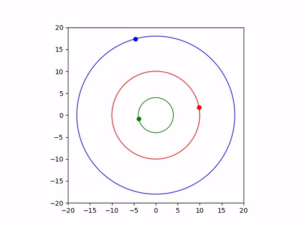
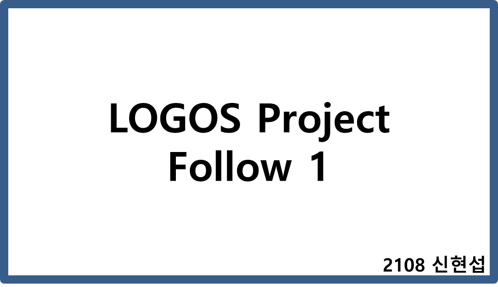
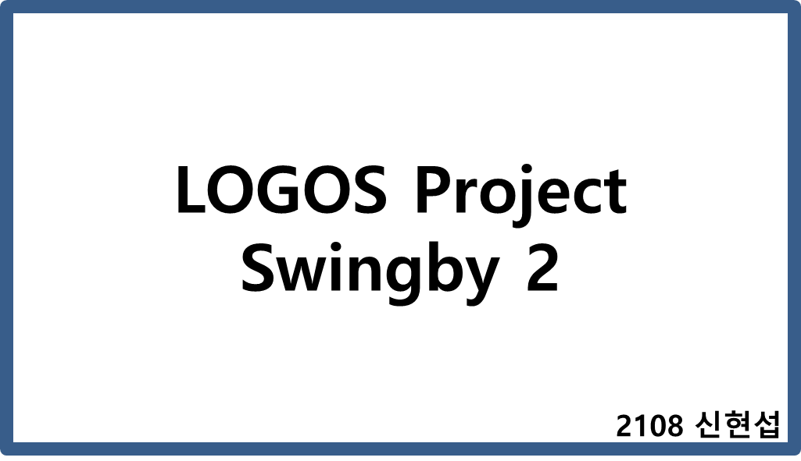

# ◉ LOGOS Project : Reinforcement Learning

동아리 주제탐구에 대한 선행연구로 진행하였습니다

### ✔ 강화학습(Reinforcement Learning)이란?

"주변 상태에 따라 어떤 행동을 할지 판단을 내리는 주체인 에이전트가 있고, 에이전트가 속한 환경이 있습니다. 에이전트가 행동을 하면 그에 따라 상태가 바뀌게 되고, 보상을 받을 수도 있습니다. 강화학습의 목표는 주어진 환경에서 보상을 최대한 많이 받을 수 있는 에이전트를 학습하는 것입니다." - Samsung SW Membership

본 탐구에서는 몬테카를로 방법(Monte-Carlo Method)을 이용하여 강화학습을 진행하였다. 몬테카를로 방법의 핵심은

- 일단 해본다(여러 경우의 수를 해본다)
- 여러 경우에 대해 평가를 통하여 자신을 업데이트한다
- 업데이트한 정보를 이용하여 다시 한다
- 다시 평가하여 업데이트한다

위 과정에서 평가의 잣대로 작용하는 것을 가치함수(value function)이라고 부르며 문제상황에 따라 달라질 수 있다. 간다하게 말해서 강화학습의 목표는 가치함수를 최대로 하는 방법을 찾는 것이라고도 할 수 있다.

### ✔ 탐구 개요

위의 상황과 같이 세 행성이 동심원의 궤도를 따라 공전할 때 초록색의 가장 안쪽 궤도의 행성(이하 출발행성)에서 출발하여 가장 바깥쪽의 파란색 행성(이하 목표행성)까지 도달하는 최적경로를 탐색하는 몬테카를로 방법 기반의 강화학습 알고리즘을 설계한다.
(딥러닝 및 라이브러리를 사용하지 않고!)

### ✔ 행성에서의 출발

모든 우주선들은 출발행성의 연직 상방으로 일정거리만큼 떨어진 위치에서 특정 속도를 가지고 출발한다. 또한 각 우주선은 다음과 같은 정보를 갖는다.

- x, y: 우주선의 좌표
- fuel: 가속에 필요한 연료의 총량
- weights: 각 시간대에 x, y방향 가속에 사용할 연료량
- vx, vy: x, y 방향의 속도
- value: 가치함수값
- calc: 계산여부
- isgood: 목표행성 도달여부

### ✔ 우주선의 우주유영

우주선은 각 step마다 weights의 정보를 바탕으로 연료를 소비하면서 가속하게 된다. 이때 다음과 같은 조건이 충족되면 더 이상의 운동을 하지 않는다. 즉, calc=False가 된다.

- 행성과의 충돌(단, 목표행성인 경우 isgood=True)
- 연료 고갈(fuel < 0)
- 궤도이탈(주어진 환경에서 너무 멀어짐)

위 세 조건을 통과 우주선들에 대해 가치함수를 계산한다. 그 식은 다음과 같다.

v(s) = (출발행성으로부터의 거리)/(목표행성까지의 거리)³

또한 기존의 가치함수값(value)에 특정 상수(r)를 곱한 값과 v(s)\*(1-r)한 값을 합하여 최종 가치함수를 업데이트한다.

### ✔ 자식 생산

모든 우주선이 불능상태(calc=False)가 되거나 제시한 step수 만큼의 시간이 흘렀을 때, 가장 결과가 좋은 우주선의 weight를 바탕으로 자식 즉, 다음 우주유영할 우주선을 생성하게 된다.  
만약 목표행성에 도달(isgood=True)인 우주선이 있다면 그중에서 가장 value가 높은 우주선을 어떤 우주선도 도달하지 못했다면 전체 중 가장 value가 높은 우주선으로 자식을 생산한다.

### ✔ 결과 테스트

위 과정 들을 거쳐서 나온 가장 좋은 우주선의 weight를 이용하여 배의 궤적을 확인한다. celluloid 모듈을 이용하여 영상으로 만들어 결과를 분석한다.

### ✔ 탐구 결과

위 두 영상은 목표행성의 궤도를 탐지하여 따라가는 방법에 대한 예시이다. 출발한 우주선은 목표행성의 궤도에 진입한 뒤 안정적으로 목표행성을 따라가고 결국 따라잡게 된다.

위 두 영상은 탐사선의 항법 중 하나인 swingby를 이용해서 목표행성에 도달한 예시이다. 중간에 있는 행성의 중력을 이용하여 가속한 뒤 목표행성까지 빠르게 도달한다.

### ✔ 성능 향상을 위해 사용한 기법

- step의 계차수열  
  모든 step마다 연산을 하게 된다면 그 양이 방대하여 시간과 메모리 면에서 비효율 적이므로 특정 step이 지날 때마다 가치함수를 구하고 업데이트는 하는 것이 좋다.  
  이때 연산을 수행할 step수를 계차수열의 원소로 선택했다. 예를 들어 step수가 1, 2, 4, 7, 11 순으로 나아가며 연산을 수행하는 것이다. 기존의 등차수열보다 획기적인 개선을 보였으며 이는 초반에서의 방향 조절이 중요함을 알려준다.

- 가치함수 조작  
  목표행성까지의 거리만으로 가치 함수를 산정하니 출발하자마자 다시 출발행성에 부딪히는 상황을 관찰할 수 있었다. 따라서 가치함수에 출발행성과의 거리를 추가하였고 그 거리가 비교적 가까울 때는 멀어질 수록 가치함수가 커지나 분모에 (목표행성까지의 거리)³을 두어 결정적인 부분에 중점을 두었다.

### ✔ 개선 방안

- 좋은 모델을 뽑기 위해 매개변수와 상수들을 조작했지만 실제값에 맞추어 진행한다면 더 의미있는 겨로가를 낼 수 있을 것이다.

- 모델이 local optimum이 빠지지 않기 위해 ɛ을 이용하여 랜덤으로 값을 업데이트 하는 성능 개선 기법을 적용한다면 더 큰 영역에서 매우 효과적으로 작용할 것이다.

- 학습 알고리즘의 개선과 더 나은 step수 조절을 통해 성능을 개선시킬 수 있을 것이다.
